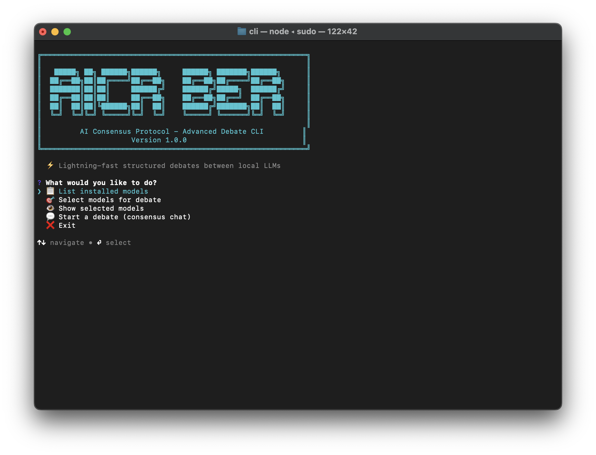
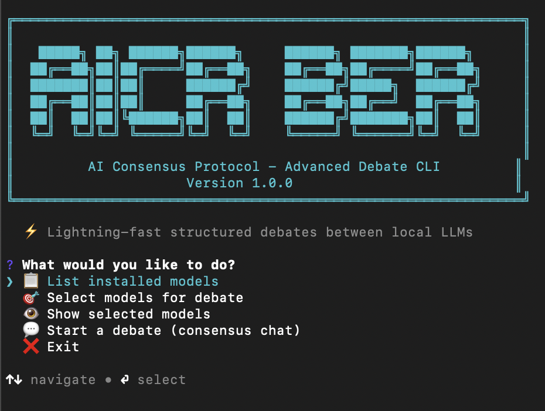

# 🤖 AICP – AI Consensus Protocol

[](https://opensource.org/licenses/MIT)
[](https://www.typescriptlang.org/)
[](https://ollama.ai)
[](CONTRIBUTING.md)
[](https://nodejs.org)

**AICP** is a production-grade framework that orchestrates **structured debates** between multiple local LLMs, then **votes** to reach a consensus. It combines Byzantine Fault Tolerance (BFT), swarm intelligence (PSO), and real-time streaming to deliver a unified, authoritative answer.



---

## 📋 Table of Contents

- [Features](#-features)
- [How It Works](#-how-it-works)
- [Prerequisites](#-prerequisites)
- [Installation](#-installation)
- [Quick Start](#-quick-start)
- [Detailed Usage](#-detailed-usage)
  - [1. Selecting Models](#1-selecting-models)
  - [2. Starting a Debate](#2-starting-a-debate)
  - [3. Understanding the Debate Flow](#3-understanding-the-debate-flow)
  - [4. Command Line (Advanced)](#4-command-line-advanced)
- [Configuration](#-configuration)
- [Architecture](#-architecture)
- [Troubleshooting](#-troubleshooting)
- [Contributing](#-contributing)
- [License](#-license)

---

## ✨ Features

- 🧠 **Multi-model debates** – run llama2, mistral, phi3, gemma, etc. side by side.
- 🗳️ **Democratic voting** – models vote for the best answer (cannot vote for themselves).
- ⚡ **Real-time streaming** – watch every argument, rebuttal, and vote as it happens.
- 🛡️ **BFT-inspired consensus** – Byzantine fault tolerance (optional) for critical applications.
- 🐝 **Swarm optimisation** – Particle Swarm Optimisation (PSO) dynamically weights model responses.
- 📊 **Reputation system** – models gain or lose reputation based on past debate performance.
- 🖥️ **Modern CLI** – interactive menu with logo, coloured output, and intuitive workflow.
- 🔌 **Extensible** – pluggable consensus algorithms, memory layers, and P2P networking.

---

## ⚙️ How It Works

1. **Warmup** – Each selected model is sent a trivial prompt to measure latency. Models that are too slow (>30s) are automatically excluded.
2. **Proposals** – Every model gives its initial answer to the question.
3. **Argument round** – Models see all proposals, critique others, defend their own, and concede points where appropriate.
4. **Rebuttal rounds** – (optional, configurable) Models continue debating, refining their positions.
5. **Voting** – Each model (except the voter itself) votes for the most accurate/well-reasoned answer, providing a reason and confidence score.
6. **Synthesis** – The winning model writes a final, unified answer for the user, integrating insights from the entire debate.

All steps are **streamed** to the terminal in real time – you see every token as it is generated.

---

## 📦 Prerequisites

- **Node.js** 18 or later (tested with v20+)
- **Ollama** installed and running
- At least one LLM pulled, e.g.:

```bash
ollama pull llama3:8b
ollama pull mistral:7b
````

* **npm** or **yarn** (npm is used in examples)

> **Note**: For optimal debate quality, use models with at least 7B parameters. 2B models may give very short or irrelevant answers.

---

## 🛠 Installation

### 1. Clone the repository

```bash
git clone https://github.com/devdanielvaldez/aicp-advanced.git
cd aicp-advanced
```

### 2. Install dependencies

```bash
npm install
```

### 3. Build all packages

```bash
npm run build
```

### 4. (Optional) Install the CLI globally

```bash
npm install -g ./packages/cli
```

Now you can run `aicp` from anywhere.

---

## 🚀 Quick Start

Once installed, start the interactive CLI:

```bash
cd packages/cli
npm run dev
```

Or if you installed globally:

```bash
aicp
```

You will see the main menu:



### Steps for a First Debate

1. **List installed models** – verify that Ollama is running and see what models you have.
2. **Select models** – choose at least two models that you want to debate.
3. **Start a debate** – enter your question and the number of rounds (1–5).
4. **Watch the debate** – sit back and watch the models argue in real time.
5. **Read the final answer** – the winning model synthesises the consensus.

---

## 📖 Detailed Usage

### 1. Selecting Models

* Use the interactive menu and choose `🎯 Select models for debate`.
* A checklist of all locally available models appears.
* Press `space` to select/unselect, then `enter` to confirm.
* Your selection is saved in `~/.aicp/config.json`.

> **Tip**: Exclude very slow or unreliable models (like llama2:latest on CPU) to keep debates snappy.

---

### 2. Starting a Debate

From the main menu, choose `💬 Start a debate (consensus chat)`.

* **Prompt** – Type your question
  Example:
  `"Should autonomous vehicles prioritise passenger safety over pedestrians?"`
* **Rounds** – Enter a number between 1 and 5.

More rounds allow deeper discussion but take longer.

The system will then:

* Warm up all selected models (skipping those that exceed the 30-second threshold).
* Run the initial proposals phase.
* Execute the argument and rebuttal rounds.
* Display a streaming vote.
* Output the final synthesis.

---

### 3. Understanding the Debate Flow

During the debate you will see sections like:

```txt
────────────────────────────────────────────────────────────
  PHASE 1 — INITIAL PROPOSALS
────────────────────────────────────────────────────────────
[mistral:7b] streaming:
 REASONING: ...
 ANSWER: ...
  (32701ms)

────────────────────────────────────────────────────────────
  PHASE 2 — ARGUMENTS
────────────────────────────────────────────────────────────
[llama3.2:1b] streaming:
 CRITIQUE: ...
 DEFENSE: ...
 CONCESSION: ...
```

All text appears **token by token** exactly as the model generates it, giving you immediate feedback.

After the debate, you see:

```txt
  VOTE RESULTS:
  ███░ mistral:7b: 3 vote(s)
  █░░░ llama3.2:1b: 1 vote(s)

  🏆 WINNER: mistral:7b with 3 vote(s)

  FINAL ANSWER
  (by mistral:7b · 3/4 votes · 125712ms)

  [synthesised answer]
```

---

### 4. Command Line (Advanced)

If you prefer a non-interactive approach, you can use the CLI with arguments (if installed globally):

```bash
aicp list
aicp select
aicp consensus "Is AI dangerous?" --rounds 2
```

Inside the `packages/cli` directory, you can also run:

```bash
npm run dev consensus "Your question" -- --rounds 3
```

---

## ⚙️ Configuration

All user configuration is stored in:

```txt
~/.aicp/
```

| File            | Purpose                                      |
| --------------- | -------------------------------------------- |
| `config.json`   | Selected models, P2P settings (future)       |
| `reputation.db` | SQLite database with model reputation scores |

You can manually edit `config.json`:

```json
{
  "selectedModels": ["mistral:7b", "phi3:latest"],
  "p2pEnabled": false,
  "bootstrapPeers": []
}
```

### Reputation System

Reputation is automatically updated after each debate based on:

* **Accuracy** – whether a model’s final answer belonged to the winning cluster.
* **Energy** – latency (slower models lose a small amount of reputation).
* **Honesty** – reserved for future cross-endorsements.

---

## 🏗 Architecture

AICP is a **monorepo** with four TypeScript packages:

```txt
aicp-advanced/
├── packages/
│   ├── core/         # Consensus algorithms, BFT, PSO, reputation, vector memory
│   ├── cli/          # Interactive CLI, debate orchestrator, streaming LLM client
│   ├── api/          # REST API (Prometheus metrics – stub)
│   └── p2p/          # Libp2p peer-to-peer layer (experimental)
└── tsconfig.base.json
```

### `@aicp/core`

* **BFTAdaptiveConsensus** – Byzantine fault tolerance with adaptive thresholds.
* **ReputationManager** – persistent SQLite storage with exponential decay.
* **SwarmConsensusOptimizer** – Particle Swarm Optimisation for dynamic model weighting.
* **VectorMemory** – in-memory vector store for semantic similarity.

### `@aicp/cli`

* **Debate phases** – proposals, arguments, rebuttals, voting, synthesis.
* **Streaming client** – uses Ollama’s `/api/chat` with `stream: true`.
* **Refusal detection** – catches phrases like “I cannot answer” and retries/excludes models.
* **Vote parsing** – robust extraction of `VOTE: <model_id>` even when extra text appears.

All communication with Ollama is done via HTTP (no child processes). The timeout is set to 300 seconds to accommodate slow models; slow models are excluded by the warmup phase.

---

## 🐞 Troubleshooting

### “Ollama is not running”

Start Ollama:

```bash
ollama serve
```

Verify with:

```bash
ollama list
```

Or:

```bash
curl http://localhost:11434/api/tags
```

---

### Models Are Excluded During Warmup (Too Slow)

* The default threshold is 30 seconds.
* You can increase it in:

```txt
packages/cli/src/debate/config.ts
```

Variable:

```ts
SLOW_MODEL_THRESHOLD_MS
```

* Alternatively, use faster models like:

  * `phi3:mini`
  * `mistral:7b`

---

### A Model Never Responds (Hangs)

* The system retries twice, then excludes the model.
* If it happens repeatedly, deselect that model.
* Increase the timeout in:

```txt
packages/cli/src/ollama/client.ts
```

Current timeout:

```ts
300000 // ms
```

---

### Votes Are Unparseable or Models Vote for Themselves

* Lower the temperature further (e.g. `0.01`).
* Check raw output:
  The parser searches for a line beginning with:

```txt
VOTE:
```

---

### Reputation Scores Stay at `0.000`

* Ensure:

```txt
~/.aicp/reputation.db
```

is writable.

* The default initial score is `0.5`.

After one successful debate, scores should become positive.

---

### The Final Answer Is Too Long

The synthesis prompt targets a max of ~250 words.

Reduce:

```txt
TOKENS.synthesis
```

inside:

```txt
packages/cli/src/debate/config.ts
```

Current default:

```ts
500
```

---

## 🤝 Contributing

We welcome contributions.

Please read:

```txt
CONTRIBUTING.md
```

### Development Workflow

```bash
git clone https://github.com/devdanielvaldez/aicp-advanced.git
cd aicp-advanced
npm install
npm run build

cd packages/cli
npm run dev
```

To add a feature or fix a bug:

1. Create a new branch.
2. Make your changes.
3. Test thoroughly.
4. Open a Pull Request.

---

## 📄 License

Distributed under the MIT License.

See:

```txt
LICENSE
```

for more information.

---

## 🙏 Acknowledgements

* [Ollama](https://ollama.ai) – local LLM runtime
* [libp2p](https://libp2p.io) – future P2P networking
* [Inquirer.js](https://github.com/SBoudrias/Inquirer.js) – CLI prompts

---

## ❤️ Built for the Open-Source AI Community

AICP was created to explore collaborative reasoning between local AI systems through structured debate, consensus formation, and autonomous synthesis.