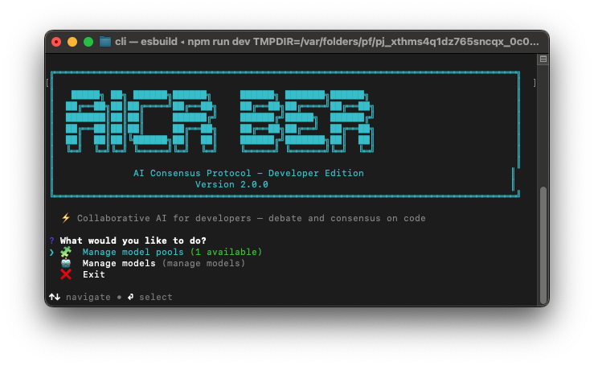

# 🤖 AICP – AI Consensus Protocol

[](https://opensource.org/licenses/MIT)
[](https://www.typescriptlang.org/)
[](https://ollama.ai)
[](CONTRIBUTING.md)
[](https://brew.sh)

**AICP** is a developer‑first platform that transforms local LLMs into collaborative coding teams. Create **model pools** (e.g., "TypeScript Squad"), let them debate, vote, and produce production‑ready code – all in real time, 100% local via Ollama.



---

## 🎯 What is AICP?

Stop trusting a single AI. Instead, assemble a **team of models** that discuss, critique, and vote on the best solution for your coding tasks. Whether you need a REST API, a data pipeline, or a frontend component – AICP delivers a consensus‑driven answer you can actually use.

- **Model Pools** – group models by specialty (TypeScript, Python, Rust, etc.).
- **Real‑time code debates** – watch models propose, argue, and refine code.
- **Live streaming** – see every token, every criticism, every vote.
- **Final answer with syntax highlighting** – polished markdown output ready to copy.

---

## ✨ Features

| Feature | Description |
|---------|-------------|
| 🧠 **Model Pools** | Create named teams of models with a custom specialty description. Auto‑generated system prompts. |
| 💬 **Code‑focused debates** | Structured prompts for REASONING + CODE. Language‑agnostic. |
| ⚡ **Real‑time streaming** | See token‑by‑token output of arguments, rebuttals, and final code. |
| 🗳️ **Democratic voting** | Models vote for the best code solution (self‑votes are rejected). |
| 🎨 **Markdown rendering** | Syntax‑highlighted code blocks, bold, italic, lists – right in your terminal. |
| 🧠 **Long‑term memory** (RAG) | Past debates are stored and retrieved for context (optional). |
| 🚀 **Turbo mode** | Automatically optimises system resources for faster inference. |
| 📊 **Reputation system** | Models gain/lose reputation based on accuracy, honesty, and energy. |
| 🖥️ **Modern CLI** | Mouse‑friendly, keyboard‑driven menus with animations and pool count display. |
| 🍺 **Homebrew ready** | Install with `brew tap devdanielvaldez/aicp && brew install aicp`. |

---

## ⚙️ How It Works (Developer Edition)

1. **Create a pool** – give it a name and description (e.g., *“Expert TypeScript backend developers”*).
2. **Select models** – choose which Ollama models belong to the pool.
3. **Chat with the pool** – type a coding request (e.g., *“Create an Express API to convert meters to centimeters”*).
4. **Models debate** – each model proposes a solution (REASONING + CODE).
5. **Argument & rebuttal rounds** – models critique, defend, and refine.
6. **Voting** – models vote for the best code (cannot vote for themselves).
7. **Synthesis** – the winning model writes the final answer with a markdown code block.
8. **You get the code** – ready to copy, paste, and run.

All steps stream live to your terminal – you see every line of reasoning and every line of code as it’s generated.

---

## 📦 Prerequisites

- **Node.js** 18+ (tested with v20+)
- **Ollama** installed and running ([ollama.ai](https://ollama.ai))
- At least two models pulled, for example:

```bash
ollama pull llama3:8b
ollama pull mistral:7b
ollama pull phi3:mini
```

> **Recommendation**: Use models with at least 7B parameters for best code quality. Small models (1B‑2B) may produce incomplete code.

---

## 🛠 Installation

### Option 1: Homebrew (macOS – recommended)

```bash
brew tap devdanielvaldez/aicp
brew install aicp
```

Then run `aicp` from anywhere.

### Option 2: From source

```bash
git clone https://github.com/devdanielvaldez/aicp-advanced.git
cd aicp-advanced
npm install
npm run build
cd packages/cli
npm run dev
```

Or install globally:

```bash
npm install -g ./packages/cli
aicp
```

---

## 🚀 Quick Start

```bash
aicp
```

You will see the main menu with:

- 🧩 **Manage model pools** – create, list, edit, delete, and chat with pools.
- 🤖 **Manage models** – list and select which models are available for pools.

### Create your first pool

1. Choose **Manage model pools** → **Create pool**.
2. Enter a name (e.g., `typescript-backend`).
3. Enter a description (e.g., *“Expert TypeScript backend developers for Node.js, Express, and REST APIs”*).
4. Select at least two models from your installed list.
5. The system auto‑generates a system prompt.
6. Choose **Chat with pool** and start coding.

### Example chat

```text
> Create an Express API to convert meters to centimeters

🤖 Models are debating...

[llama3:8b] streaming:
REASONING: Simple, type‑safe solution with input validation...
CODE:
```typescript
import express from 'express';
const app = express();
app.use(express.json());
app.post('/convert', (req, res) => {
  const { meters } = req.body;
  if (typeof meters !== 'number') return res.status(400).json({ error: 'Invalid input' });
  res.json({ centimeters: meters * 100 });
});
app.listen(3000);
```

After debate and voting, the winning model streams the final answer with syntax highlighting.

---

## 📖 Detailed Usage

### Model Pools

| Command | Description |
|---------|-------------|
| `Create pool` | Interactive creation with name, description, and model selection. |
| `List pools` | Shows all pools with their descriptions and model counts. |
| `Show pool details` | Displays full info including the generated system prompt. |
| `Edit pool` | Change description, add/remove models, optionally regenerate system prompt. |
| `Delete pool` | Remove a pool permanently. |
| `Regenerate system prompt` | Re‑create the system prompt using the first model in the pool. |
| `Chat with pool` | Enter a REPL where you send coding requests and get final answers. |

### Chat Commands

Inside a pool chat:

- `/verbose` – toggle detailed debate logs.
- `/exit` – leave the chat.
- `/help` – show commands.

### Configuration

All data is stored in `~/.aicp/`:

- `pools.json` – your model pools.
- `reputation.db` – model reputation scores.
- `config.json` – global settings (selected models, etc.).

---

## 🏗 Architecture

AICP is a TypeScript monorepo with three active packages (P2P is experimental and not used in the developer edition):

```
aicp-advanced/
├── packages/
│   ├── core/        # Consensus, reputation, vector memory, PSO (optional)
│   ├── cli/         # Interactive CLI, debate orchestrator, streaming client, pools
│   └── api/         # REST API (stub)
└── tsconfig.base.json
```

The core debate engine (`phases.ts`) is reused for pools, but with custom prompts tailored for code generation. All communication with Ollama uses HTTP streaming (`/api/chat` with `stream: true`).

---

## 🐞 Troubleshooting

| Problem | Solution |
|---------|----------|
| `Ollama is not running` | Start Ollama: `ollama serve`. |
| Models time out | Increase `OLLAMA_HOST` timeout in `packages/cli/src/ollama/client.ts` (default 300s). |
| Pool chat not responding | Ensure you have selected at least two models for the pool. |
| Final answer truncated | Raise `TOKEN_LIMITS.synthesis` in `packages/cli/src/pools/debate.ts` (default 65536). |
| Homebrew installation fails | Make sure you have Node.js installed (`brew install node`), then `brew install aicp`. |

---

## 🤝 Contributing

We love contributions! See [CONTRIBUTING.md](CONTRIBUTING.md).

```bash
git clone https://github.com/devdanielvaldez/aicp-advanced.git
cd aicp-advanced
npm install
npm run build
cd packages/cli
npm run dev
```

Then open a Pull Request.

---

## 📄 License

MIT © [devdanielvaldez](https://github.com/devdanielvaldez)

---

## 🙏 Acknowledgements

- [Ollama](https://ollama.ai) – local LLM runtime
- [Inquirer.js](https://github.com/SBoudrias/Inquirer.js) – beautiful CLI prompts
- [Highlight.js](https://highlightjs.org/) – syntax highlighting for terminal

---

**Built with ❤️ for developers who want reliable AI code assistance.**

[GitHub Repository](https://github.com/devdanielvaldez/aicp-advanced) – ⭐ star and fork welcome!